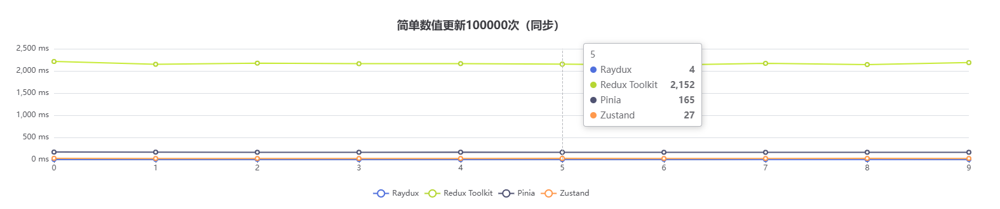
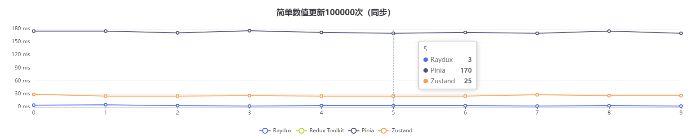
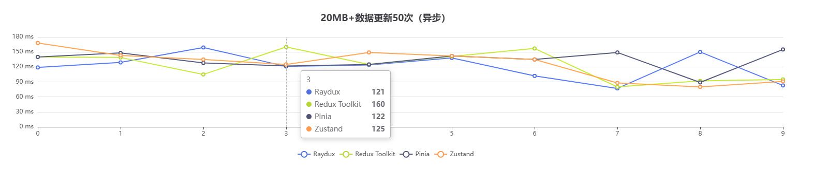

# 安装

`npm i`

# 启动

`npm start`

# Benchmark

对比了 `3` 款比较火的状态管理工具：

- `Redux toolkit`
- `Pinia`（Vue 官方推荐代替 VueX）
- `Zustand`

## 同步更新10万次简单数值

得益于 `Raydux` 的帧尾结算式更新，在同一帧多次修改的示例上表现非常出色，时间复杂度仅为 O(1)，性能远高于其他工具（特别是 `Redux toolkit`）。它们的性能由高到低排序为：

`Raydux` > `Zustand` > `Pinia` >>> `Redux toolkit`

由于 `Redux toolkit` 的性能差异较大，其他3款工具性能看不清楚，去掉它再看一遍：

## 异步更新50次大型数据（20MB+）

因为每次生成大型数据耗时过久，且很占内存，因此仅做了50次更新的测试。可以看到4款工具性能交织非常厉害，基本上不分上下:

